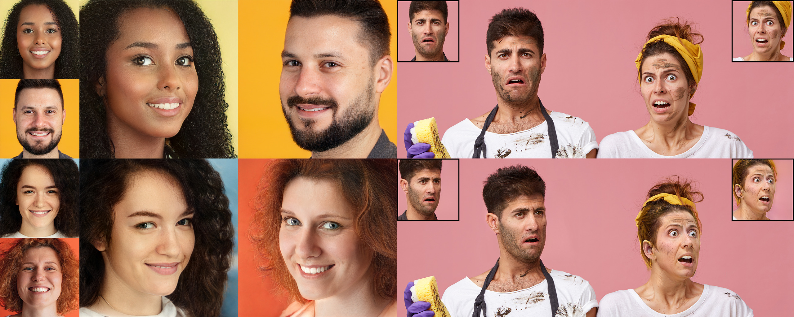

## Unofficial PyTorch implementation of<br><sub>Ray Conditioning: Trading Photo-Consistency for Photo-realism in multi-view image generation</sub>



**Ray Conditioning: Trading Photo-Consistency for Photo-realism in multi-view image generation**<br>
Eric Ming Chen, Sidhanth Holalkere, Ruyu Yan, Kai Zhang, and Abe Davis<br>
https://ray-cond.github.io/<br>

Abstract: *Multi-view image generation attracts particular attention these days due to its promising 3D-related applications, e.g., image viewpoint editing. Most existing methods follow a paradigm where a 3D representation is first synthesized, and then rendered into 2D images to ensure photo-consistency across viewpoints. However, such explicit bias for photo-consistency sacrifices photo-realism, causing geometry artifacts and loss of fine-scale details when these methods are applied to edit real images. To address this issue, we propose ray conditioning, a geometry-free alternative that relaxes the photo-consistency constraint. Our method generates multi-view images by conditioning a 2D GAN on a light field prior. With explicit viewpoint control, state-of-the-art photo-realism and identity consistency, our method is particularly suited for the viewpoint editing task.*

## Disclaimer
I'm not related to the authors in any ways.

## Requirements

* Linux and Windows are supported, but we recommend Linux for performance and compatibility reasons.
* 1&ndash;8 high-end NVIDIA GPUs with at least 12 GB of memory. We have done all testing and development using Tesla V100 and A100 GPUs.
* 64-bit Python 3.8 and PyTorch 1.9.0 (or later). See https://pytorch.org for PyTorch install instructions.
* CUDA toolkit 11.1 or later.  (Why is a separate CUDA toolkit installation required?  See [Troubleshooting](./docs/troubleshooting.md#why-is-cuda-toolkit-installation-necessary)).
* GCC 7 or later (Linux) or Visual Studio (Windows) compilers.  Recommended GCC version depends on CUDA version, see for example [CUDA 11.4 system requirements](https://docs.nvidia.com/cuda/archive/11.4.1/cuda-installation-guide-linux/index.html#system-requirements).
* Python libraries: see [environment.yml](./environment.yml) for exact library dependencies.  You can use the following commands with Miniconda3 to create and activate your StyleGAN3 Python environment:
  - `conda env create -f environment.yml`
  - `conda activate raycond`
* Docker users:
  - Ensure you have correctly installed the [NVIDIA container runtime](https://docs.docker.com/config/containers/resource_constraints/#gpu).
  - Use the [provided Dockerfile](./Dockerfile) to build an image with the required library dependencies.

The code relies heavily on custom PyTorch extensions that are compiled on the fly using NVCC. On Windows, the compilation requires Microsoft Visual Studio. We recommend installing [Visual Studio Community Edition](https://visualstudio.microsoft.com/vs/) and adding it into `PATH` using `"C:\Program Files (x86)\Microsoft Visual Studio\<VERSION>\Community\VC\Auxiliary\Build\vcvars64.bat"`.

See [Troubleshooting](./docs/troubleshooting.md) for help on common installation and run-time problems.

## Getting started

Pre-trained networks are stored as `*.pkl` files that can be referenced using local filenames or URLs:

```.bash
# Generate an image using pre-trained FFHQ model.
python gen_images.py --outdir=out --trunc=1 --seeds=2 \
    --network=weights/raycond-ffhq-512x512.pkl

# Generate multiple images using pre-trained FFHQ model with seed from 0 to 31.
python gen_images.py --outdir=out --trunc=1 --seeds=0-31 \
    --network=weights/raycond-ffhq-512x512.pkl
```

Outputs from the above commands are placed under `out/*.png`, controlled by `--outdir`. Downloaded network pickles are cached under `$HOME/.cache/dnnlib`, which can be overridden by setting the `DNNLIB_CACHE_DIR` environment variable. The default PyTorch extension build directory is `$HOME/.cache/torch_extensions`, which can be overridden by setting `TORCH_EXTENSIONS_DIR`.

**Docker**: You can run the above curated image example using Docker as follows:

```.bash
# Build the raycond:latest image
docker build --tag raycond .

# Run the gen_images.py script using Docker:
docker run --gpus all -it --rm --user $(id -u):$(id -g) \
    -v `pwd`:/scratch --workdir /scratch -e HOME=/scratch \
    raycond \
    python gen_images.py --outdir=out --trunc=1 --seeds=2 \
         --network=weights/raycond-ffhq-512x512.pkl
```

Note: The Docker image requires NVIDIA driver release `r470` or later.

The `docker run` invocation may look daunting, so let's unpack its contents here:

- `--gpus all -it --rm --user $(id -u):$(id -g)`: with all GPUs enabled, run an interactive session with current user's UID/GID to avoid Docker writing files as root.
- ``-v `pwd`:/scratch --workdir /scratch``: mount current running dir (e.g., the top of this git repo on your host machine) to `/scratch` in the container and use that as the current working dir.
- `-e HOME=/scratch`: let PyTorch and the code know where to cache temporary files such as pre-trained models and custom PyTorch extension build results. Note: if you want more fine-grained control, you can instead set `TORCH_EXTENSIONS_DIR` (for custom extensions build dir) and `DNNLIB_CACHE_DIR` (for pre-trained model download cache). You want these cache dirs to reside on persistent volumes so that their contents are retained across multiple `docker run` invocations.

## Using networks from Python

You can use pre-trained networks in your own Python code as follows:

```.python
with open('ffhq.pkl', 'rb') as f:
    G = pickle.load(f)['G_ema'].cuda()  # torch.nn.Module
z = torch.randn([1, G.z_dim]).cuda()    # latent codes
c = None                                # class labels (not used in this example)
img = G(z, c)                           # NCHW, float32, dynamic range [-1, +1], no truncation
```

The above code requires `torch_utils` and `dnnlib` to be accessible via `PYTHONPATH`. It does not need source code for the networks themselves &mdash; their class definitions are loaded from the pickle via `torch_utils.persistence`.

The pickle contains three networks. `'G'` and `'D'` are instantaneous snapshots taken during training, and `'G_ema'` represents a moving average of the generator weights over several training steps. The networks are regular instances of `torch.nn.Module`, with all of their parameters and buffers placed on the CPU at import and gradient computation disabled by default.

The generator consists of two submodules, `G.mapping` and `G.synthesis`, that can be executed separately. They also support various additional options:

```.python
w = G.mapping(z, truncation_psi=0.5, truncation_cutoff=8)
img = G.synthesis(w, c, noise_mode='const', force_fp32=True)
```

Please refer to [`gen_images.py`](./gen_images.py) for complete code example.

## Preparing datasets

Datasets are stored as uncompressed ZIP archives containing uncompressed PNG files and a metadata file `dataset.json` for labels. Custom datasets can be created from a folder containing images; see [`python dataset_tool.py --help`](./docs/dataset-tool-help.txt) for more information. Alternatively, the folder can also be used directly as a dataset, without running it through `dataset_tool.py` first, but doing so may lead to suboptimal performance.

See the [EG3D README](https://github.com/NVlabs/eg3d) for information on how to obtain and preprocess FFHQ and AFHQv2 dataset.

## Training

You can train new networks using `train.py`. For example:

```.bash
# Train for FFHQ using 8 GPUs.
python train.py --outdir=~/training-runs --data=~/datasets/ffhq-512x512.zip \
    --gpus=8 --batch=32 --gamma=8.2 --mirror=1

# Resume training from an pretrained model.
python train.py --outdir=~/training-runs --data=~/datasets/ffhq-512x512.zip \
    --gpus=8 --batch=32 --gamma=8.2 --mirror=1 --kimg=5000 --snap=5 \
    --resume=weights/raycond-ffhq-512x512.pkl
```

Note that the result quality and training time depend heavily on the exact set of options. The most important ones (`--gpus`, `--batch`, and `--gamma`) must be specified explicitly, and they should be selected with care. See [`python train.py --help`](./docs/train-help.txt) for the full list of options.

The results of each training run are saved to a newly created directory, for example `~/training-runs/00000-raycond-ffhq-512x512-gpus8-batch32-gamma8.2`. The training loop exports network pickles (`network-snapshot-<KIMG>.pkl`) and random image grids (`fakes<KIMG>.png`) at regular intervals (controlled by `--snap`). For each exported pickle, it evaluates FID (controlled by `--metrics`) and logs the result in `metric-fid50k_full.jsonl`. It also records various statistics in `training_stats.jsonl`, as well as `*.tfevents` if TensorBoard is installed.

## Quality metrics

By default, `train.py` automatically computes FID for each network pickle exported during training. We recommend inspecting `metric-fid50k_full.jsonl` (or TensorBoard) at regular intervals to monitor the training progress. When desired, the automatic computation can be disabled with `--metrics=none` to speed up the training slightly.

Additional quality metrics can also be computed after the training:

```.bash
# Previous training run: look up options automatically, save result to JSONL file.
python calc_metrics.py --metrics=kid50k_full,pr50k3_full \
    --network=~/training-runs/00000-raycond-mydataset/network-snapshot-000000.pkl

# Pre-trained network pickle: specify dataset explicitly, print result to stdout.
python calc_metrics.py --metrics=fid50k_full --data=~/datasets/ffhq-512x512.zip --mirror=1 \
    --network=weights/raycond-ffhq-512x512.pkl
```

The first example looks up the training configuration and performs the same operation as if `--metrics=kid50k_full,pr50k3_full` had been specified during training. The second example downloads a pre-trained network pickle, in which case the values of `--data` and `--mirror` must be specified explicitly.

Note that the metrics can be quite expensive to compute (up to 1h), and many of them have an additional one-off cost for each new dataset (up to 30min). Also note that the evaluation is done using a different random seed each time, so the results will vary if the same metric is computed multiple times.

Recommended metrics:
* `fid50k_full`: Fr&eacute;chet inception distance<sup>[1]</sup> against the full dataset.
* `kid50k_full`: Kernel inception distance<sup>[2]</sup> against the full dataset.
* `pr50k3_full`: Precision and recall<sup>[3]</sup> againt the full dataset.
* `ppl2_wend`: Perceptual path length<sup>[4]</sup> in W, endpoints, full image.

Legacy metrics:
* `fid50k`: Fr&eacute;chet inception distance against 50k real images.
* `kid50k`: Kernel inception distance against 50k real images.
* `pr50k3`: Precision and recall against 50k real images.
* `is50k`: Inception score<sup>[5]</sup> for CIFAR-10.

References:
1. [GANs Trained by a Two Time-Scale Update Rule Converge to a Local Nash Equilibrium](https://arxiv.org/abs/1706.08500), Heusel et al. 2017
2. [Demystifying MMD GANs](https://arxiv.org/abs/1801.01401), Bi&nacute;kowski et al. 2018
3. [Improved Precision and Recall Metric for Assessing Generative Models](https://arxiv.org/abs/1904.06991), Kynk&auml;&auml;nniemi et al. 2019
4. [A Style-Based Generator Architecture for Generative Adversarial Networks](https://arxiv.org/abs/1812.04948), Karras et al. 2018
5. [Improved Techniques for Training GANs](https://arxiv.org/abs/1606.03498), Salimans et al. 2016

## Citation
```bibtex
@misc{chen2023:ray-conditioning,
    title = {Ray Conditioning: Trading Photo-realism for Photo-Consistency in Multi-view Image Generation},
    author = {Eric Ming Chen and Sidhanth Holalkere and Ruyu Yan and Kai Zhang and Abe Davis},
    year = {2023},
    eprint={2304.13681},
    archivePrefix={arXiv},
    primaryClass={cs.CV}
}
```
